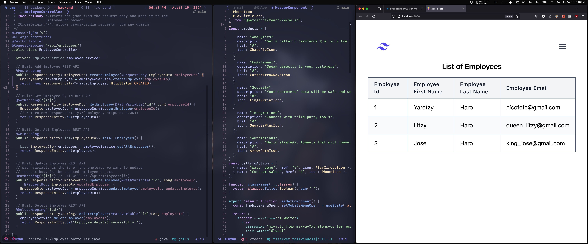

# Employee-Management-System-App



# How To Run 

```sh
git clone https://github.com/aharoJ/EmployeeManagementSystemApp.git
```

## Backend

```sh
./mvwn clean install
```
### make sure you create your own MySQL database

> src/resources/application.properties
> remove CAPS variable names and add your local information
```sh
spring.datasource.url=jdbc:mysql://localhost:3306/DATABASE_NAME
spring.datasource.username=YOUR_USERNAME
spring.datasource.password=YOUR_PASSWORD
```

### RUN the backend
```sh
 ./mvnw clean spring-boot:run
```

## Frontend

```sh
npm install --force
npm run dev
```

### RUN the frontend
```sh
 npm run dev
```